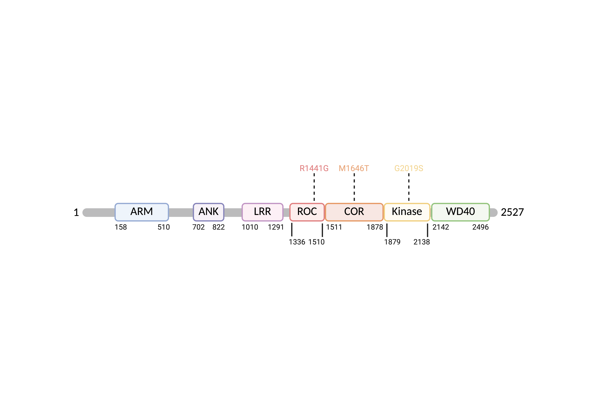
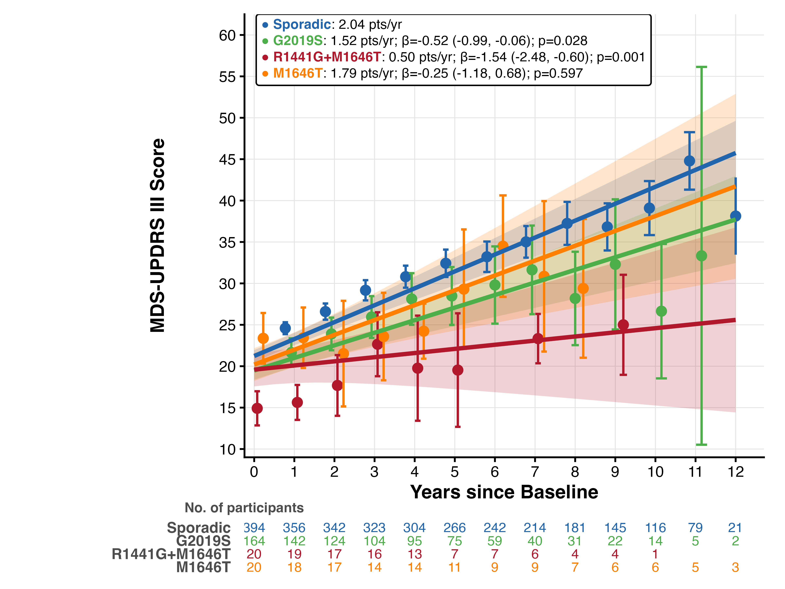
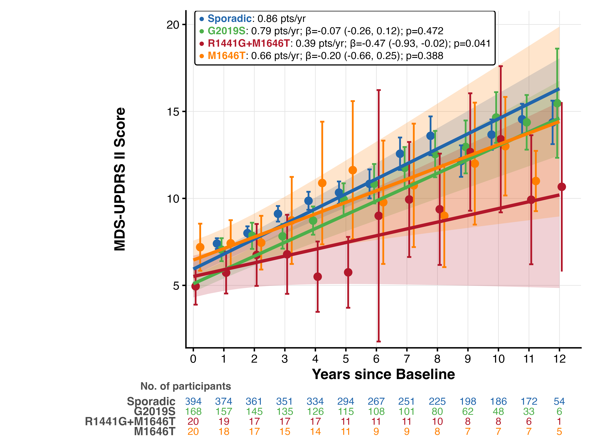

# The LRRK2 R1441G+M1646T haplotype is associated with slower motor symptom progression in Parkinson's disease

Schumacher JG, Zhang X, Wang J, Chen X.

**Preprint:** 

**Published article:** 

---

## Overview

Mutations in leucine-rich repeat kinase 2 (*LRRK2*) are the most common genetic 
risk factor for Parkinson’s disease (PD). Pathogenic variants span distinct 
functional domains of the LRRK2 protein influencing GTPase and kinase activity.
G2019S, the most common pathogenic *LRRK2* variant, has been linked to milder motor 
symptoms. R1441G, the second most common pathogenic variant, co-occurs with the PD 
risk variant M1646T on a shared haplotype, yet whether this haplotype confers a 
distinct clinical trajectory has not been investigated. While M1646T can occur 
independently, R1441G has not been reported independently of M1646T. Using 
longitudinal data from the Parkinson's Progression Markers Initiative (PPMI), we 
compared motor and non-motor symptom progression across G2019S carriers, 
R1441G+M1646T haplotype carriers, and M1646T carriers relative to sporadic PD.

Using up to 12 years of longitudinal data from the PPMI cohort (603
participants with PD and available whole-genome sequencing: 394 sporadic
PD, 169 G2019S carriers, 20 R1441G+M1646T haplotype carriers, and 20
M1646T-alone carriers), we find that G2019S and R1441G+M1646T carriers
progress more slowly than sporadic PD, while M1646T carriers do
not.

## Key Findings

- **76% slower motor progression.** R1441G+M1646T carriers (n=20)
  progressed at 0.50 MDS-UPDRS III points/year versus 2.04 in sporadic
  PD (n=394; β=-1.54, 95% CI -2.48 to -0.60, p=0.001).
- **26% slower motor progression in G2019S.** G2019S carriers (n=164)
  progressed at 1.52 points/year (β=-0.52, -0.99 to -0.06, p=0.028).
- **Slower than G2019S and M1646T.** R1441G+M1646T carriers progressed
  more slowly than G2019S carriers (β=-1.02, -2.01 to -0.03, p=0.043)
  and M1646T carriers (β=−1.29, −2.59 to 0.00, p=0.05)
- **M1646T-alone carriers did not differ from sporadic PD** (1.79
  points/year; β=-0.25, -1.18 to 0.68, p=0.597).
- **Motor subscores.** In R1441G+M1646T carriers, axial (β=-0.29,
  p=0.002), bradykinesia (β=-0.68, p=0.008), and orofacial (β=-0.21,
  p<0.001) progression were attenuated.
- **Self-reported motor symptoms.** R1441G+M1646T carriers showed 55%
  slower MDS-UPDRS II progression (β=-0.47, p=0.041).



*Figure 1A. Domain structure of the LRRK2 protein. 
Created in BioRender; not generated by the analysis code.*



*Figure 1B. Change in MDS-UPDRS III (OFF-state) in the PPMI cohort.
R1441G+M1646T carriers (n=20) progress 76% more slowly than sporadic PD
(n=394; β=-1.54, p=0.001); G2019S carriers (n=164) 26% more slowly
(β=-0.52, p=0.028). Adjusted for age at onset, disease duration at
baseline, sex, race, LEDD, and baseline score.*



*Figure 1C. Change in MDS-UPDRS II in the PPMI cohort. R1441G+M1646T
carriers progress 55% more slowly than sporadic PD (β=-0.47, p=0.041).
Adjusted for age at onset, disease duration at baseline, sex, race, and
baseline score.*

## Data Sources

Source data are not redistributed. All inputs are available to approved
researchers through PPMI. Full variable descriptions and the expected
local layout are in [`data/DATA_SOURCES.md`](data/DATA_SOURCES.md).

| Dataset | Access |
|---|---|
| PPMI (PD + Prodromal phenoconverters) | [ppmi-info.org](https://www.ppmi-info.org) |

## Repository Structure

```
lrrk2_progression/
├── README.md                       Project overview and key findings
├── LICENSE                         Apache License 2.0
├── CITATION.cff                    Machine-readable citation metadata
├── .gitignore
│
├── analysis/
│   ├── lrrk2_progression_data_prep.Rmd   Curation, exclusions, LEDD, analysis-ready workbook
│   └── lrrk2_progression_analysis.Rmd    All analysis
│
├── figures/
│   ├── fig1a_lrrk2_structure.png       LRRK2 domain schematic, BioRender (Figure 1A)
│   ├── fig1b_updrs3_progression.png    MDS-UPDRS III trajectories (Figure 1B)
│   └── fig1c_updrs2_progression.png    MDS-UPDRS II trajectories (Figure 1C)
│
├── tables/
│   ├── stable1_demographics.csv             Demographics (Supplemental Table 1)
│   ├── stable2_motor_symptoms.csv           MDS-UPDRS III/II and motor subscores (Supplemental Table 2)
│   ├── stable3_pairwise_sensitivities.csv   Pairwise contrasts and sensitivity analyses (Supplemental Table 3)
│   └── stable4_exploratory_outcomes.csv     Exploratory outcomes (Supplemental Table 4)
│
└── data/
    └── DATA_SOURCES.md             Required variables, accessions, expected local layout
```

## Analysis Overview

**lrrk2_progression_data_prep.Rmd**:

Participant selection (PD diagnosis or phenoconversion from Prodromal;
SWEDD excluded; public WGS available), exclusion of pathogenic *GBA*,
*SNCA*, *PRKN*, *PINK1*, *PARK7*, and *VPS35* carriers (IU Genetic
Consensus), four-group cohort assignment (sporadic, G2019S,
R1441G+M1646T, M1646T; WGS-first, consensus supplements), per-visit LEDD
with COMT multiplier handling, OFF-state classification, motor subscores
(tremor, rigidity, bradykinesia, axial, orofacial, and PIGD), Stebbins
TD/PIGD classification, and phenoconverter handling (`visit_year` and
age recalculated relative to conversion; disease duration at baseline set
to zero). Follow-up is capped at 12 years. Additional participant-level variables (race
detail, SAA, DBS) are derived from raw PPMI files for the demographics
table. Outputs `Data/LRRK2_Analysis_Ready.xlsx`.

**lrrk2_progression_analysis.Rmd**:

Linear mixed-effects models for OFF-state MDS-UPDRS III (primary
outcome) with participant-level random intercepts and slopes,
group-specific residual variance, adjusted for age at onset, disease
duration at baseline, sex, race, and baseline score (all interacted with
time; continuous covariates centered at means), and LEDD (main effect,
centered at zero). Age at onset and disease duration are modeled jointly:
onset equals age at PD baseline minus duration, so neither substitutes
for the other. Omnibus model with sporadic PD as reference; pairwise
contrasts via Wald tests. Motor subscore analyses (tremor, rigidity,
bradykinesia, axial, orofacial, and PIGD). MDS-UPDRS II (secondary
motor outcome). Secondary outcomes: MDS-UPDRS I/IV, MoCA, DAT-SPECT
(caudate and putamen SBR). Sensitivity analyses: SAA-adjusted and 5-year follow-up cap.

Outputs: Figure 1B (MDS-UPDRS III trajectories), Figure 1C
(MDS-UPDRS II trajectories), Supplemental Table 1 (demographics),
Supplemental Table 2 (MDS-UPDRS III/II and subscores), Supplemental
Table 3 (pairwise contrasts and sensitivity analyses), and Supplemental
Table 4 (exploratory outcomes).

## Requirements

R ≥ 4.4 with:

- nlme ≥ 3.1-164
- dplyr, tidyr, readxl
- ggplot2, ggtext
- openxlsx
- patchwork

## Reproducing

Place PPMI inputs under `Data/` at the repository root following the
layout described in each RMD's config block and in
[`data/DATA_SOURCES.md`](data/DATA_SOURCES.md), then render from the
repository root in order:

```r
rmarkdown::render("analysis/lrrk2_progression_data_prep.Rmd")
rmarkdown::render("analysis/lrrk2_progression_analysis.Rmd")
```

Both RMDs set `knitr::opts_knit$set(root.dir = normalizePath(".."))` so
all paths resolve relative to the repo root regardless of working
directory. Outputs are written to `Output/`.

## Citation

Publication pending. Please cite this repository until the peer-reviewed
article is published:

```bibtex
@article{schumacher2026lrrk2,
  title   = {The {LRRK2} R1441G+M1646T haplotype is associated with slower motor
             symptom progression in {Parkinson's} disease},
  author  = {Schumacher, Jackson G. and Zhang, Xinyuan and Wang, Jian
             and Chen, Xiqun},
  year    = {2026},
  note    = {Manuscript in preparation}
}
```

## Acknowledgements

This research was funded in part by Aligning Science Across Parkinson's
grants ASAP-000312 and MJFF-028544 through the Michael J. Fox Foundation
for Parkinson's Research (MJFF) and by the National Institutes of Health
through the National Institute of Neurological Disorders and Stroke
grant R01NS102735. For the purpose of open access, the author has
applied a CC BY public copyright license to all Author Accepted
Manuscripts arising from this submission.

Data used in the preparation of this article were obtained from the
Parkinson's Progression Markers Initiative (PPMI) database
([ppmi-info.org/data](https://www.ppmi-info.org/data)). For up-to-date
information on the study, visit
[ppmi-info.org](https://www.ppmi-info.org). PPMI is a public–private
partnership funded by the Michael J. Fox Foundation for Parkinson's
Research and funding partners, including 4D Pharma, Abbvie, AcureX,
Allergan, Amathus Therapeutics, Aligning Science Across Parkinson's,
AskBio, Avid Radiopharmaceuticals, BIAL, BioArctic, Biogen, Biohaven,
BioLegend, BlueRock Therapeutics, Bristol-Myers Squibb, Calico Labs,
Capsida Biotherapeutics, Celgene, Cerevel Therapeutics, Coave
Therapeutics, DaCapo Brainscience, Denali, Edmond J. Safra Foundation,
Eli Lilly, Gain Therapeutics, GE HealthCare, Genentech, GSK, Golub
Capital, Handl Therapeutics, Insitro, Jazz Pharmaceuticals, Johnson &
Johnson Innovative Medicine, Lundbeck, Merck, Meso Scale Discovery,
Mission Therapeutics, Neurocrine Biosciences, Neuron23, Neuropore,
Pfizer, Piramal, Prevail Therapeutics, Roche, Sanofi, Servier, Sun
Pharma Advanced Research Company, Takeda, Teva, UCB, Vanqua Bio, Verily,
Voyager Therapeutics, the Weston Family Foundation and Yumanity
Therapeutics.

## License

Apache License 2.0 — see [`LICENSE`](LICENSE).

## Contact

Jackson G. Schumacher — [jgschumacher@mgh.harvard.edu](mailto:jgschumacher@mgh.harvard.edu)
